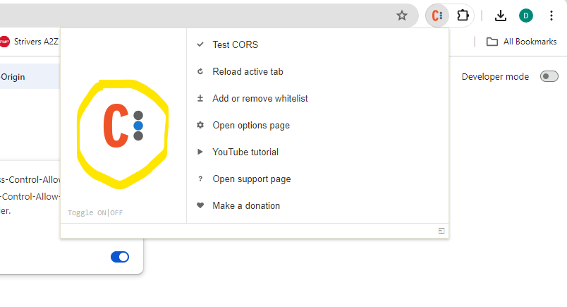
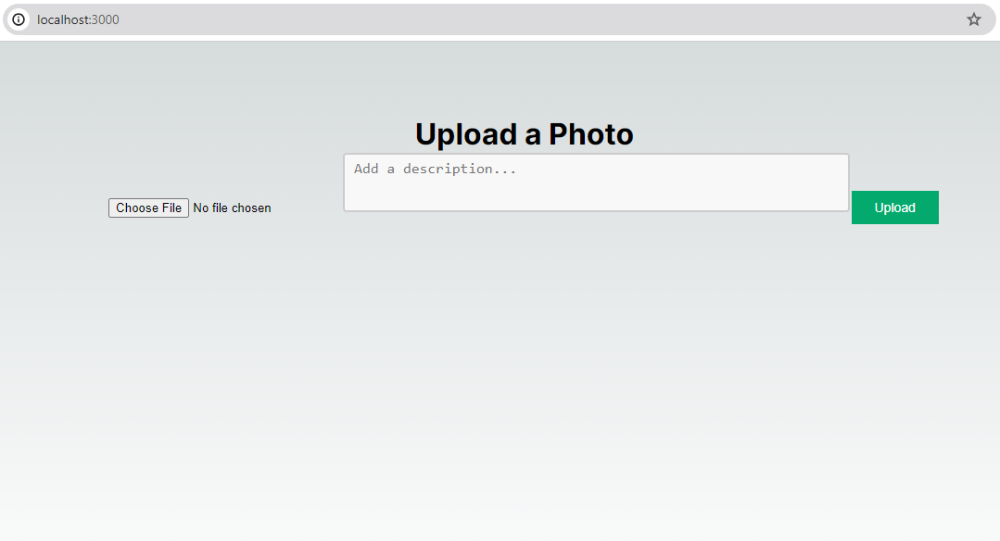
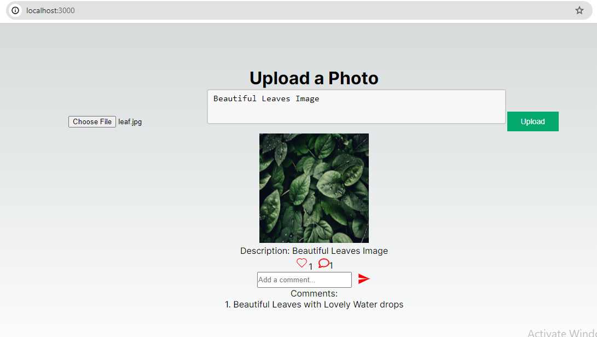

# my-instagram

## Pre-requisite
1. git clone this repositiories.
2. Install `node_modules` using below command in `Node` folder:

    ```shell
    npm install
    ```
3. Install `node_modules` and icons using below commands in `my-app` folder:

    ```shell
    npm install

    npm install react-icons --save
    ```
4. Install Chrome extension `Allow CORS: Access-Control-Allow-Origin` in chrome browser.

## Getting Started

1. Open chrome and go to extensions and open `Allow CORS` and click `twice` on the yellow color highlighted area.



2. start node server first in new terminal using below command from `Node` folder:

    ```shell
    node server.js
    ```

3. start app in new terminal with port 3000 using below command from `my-app` folder:

    ```shell
    npm run dev:port1
    ```

4. start app in new terminal with port 3001 using below command from `my-app` folder:

    ```shell
    npm run dev:port2
    ```

5. Open blow links in same chrome browser where `Allow CORS` is disabled and enabled again in step 1

    [http://localhost:3000](http://localhost:3000)

    [http://localhost:3001](http://localhost:3001)

6. It will be veisible as per below:



7. Follow the below steps

- Click on Choose File 
- select the image and give description 
- click on upload image will be visible
- click on heart for like
- give some comments

it should look like as per below:



##                                          Happy Learning
